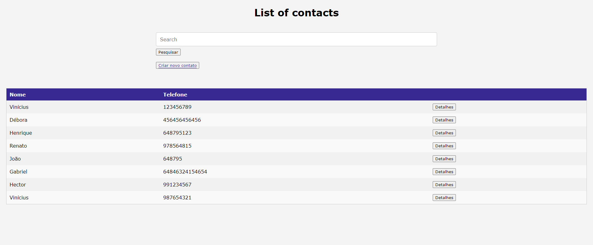
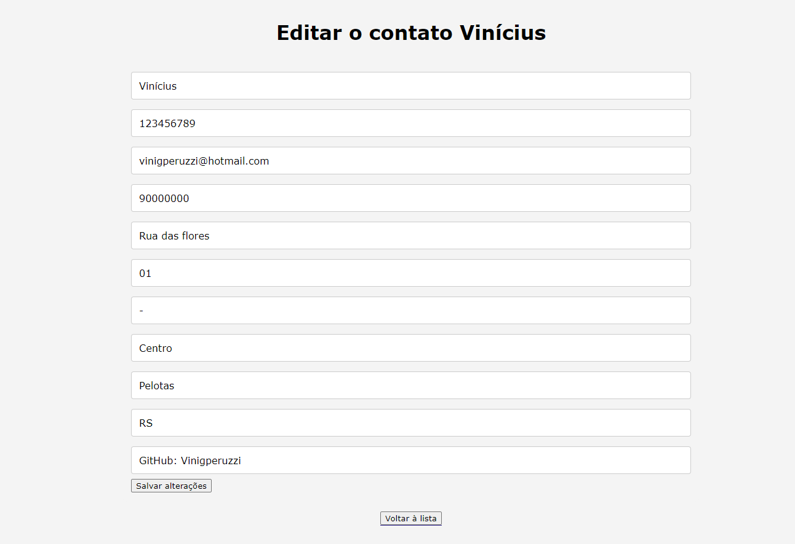

# Contact List (Desafio-Primeira_Mesa)
Challenge made by the company Primeira Mesa to select an intern in November 2023

---

## How to run:

First you have to clone this repository

> git clone https://github.com/Vinigperuzzi/Desafio-Primeira_Mesa.git

Next, copy the .env.example file to .env 

Windows (Powershell):

> Copy-item .env.example .env

Linux:

> cp .env.example .env

You have to update some configurations in .env, such as:

```
APP_NAME="Contact_List"
APP_URL=http://localhost:8989

DB_CONNECTION=mysql
DB_HOST=db
DB_PORT=3306
DB_DATABASE=contact-list
DB_USERNAME=root
DB_PASSWORD=root

CACHE_DRIVER=redis
QUEUE_CONNECTION=redis
SESSION_DRIVER=redis

REDIS_HOST=redis
REDIS_PASSWORD=null
REDIS_PORT=6379
```

Then you can up the containers with:

> docker-compose up -d

And then install the project's dependencies and generate the project's key. This must be done inside the container's terminal:

> docker-compose exec app bash

Wait for the terminal to open

> composer install

This could take a while

> php artisan key:generate

Now you can run the migration's files to create the tables in the new database:

> php artisan migrate

It may asks it you want to create the database, since it doesn't exists, so you can press y and let it create the database.
If ypu have problem you may try:

> mysql -u -root -root
> CREATE DATABASE contact-list
> exit (Para sair do mysql)


With this, you should be able to access the project Main UI in the localhost in the link below:

> http://localhost:8989/contacts

And that's it. Have fun!!

---
# Screenshots:






